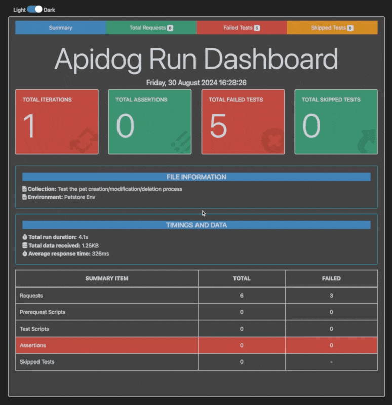

You can use the [Apidog CLI](https://www.npmjs.com/package/apidog-cli) to run test scenarios in Apidog and generate an HTML report. This reporter offers a better custom template to make test reports more user-friendly.

The reporter presents an overview dashboard with important information from the test report and interactively displays basic details of requests, enabling users to find needed information more efficiently.

This reporter is custom developed based on [newman-reporter-htmlextra](https://www.npmjs.com/package/newman-reporter-htmlextra), — **special thanks to the author.**

## Report Example

## Install

> This reporter works as a plugin for the Apidog CLI, so please ensure you have already installed the package globally using the following command: `npm install -g apidog-cli`.

To install the htmlextra, use the following command:
`npm install -g apidog-reporter-htmlextra`

## Usage

In order to enable this reporter, specify `htmlextra` in `-r` or `--reporters` option of Apidog CLI. Here is an example command:
`apidog run --access-token APS-xxxxx -t 123456 -r cli,htmlextra`

The report will be created in the `./apidog-reports directory`. If it does not exist, it should be created in the directory you specified with the `--out-dir` option.
